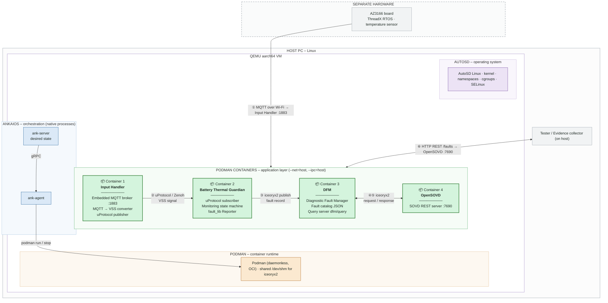

# Disclaimer
Generated with AI assist
Claud

# Diagram

```mermaid
flowchart TB
  subgraph AZHW["SEPARATE HARDWARE"]
    AZ["AZ3166 board<br/>ThreadX RTOS · temperature sensor"]
  end

  subgraph HOST["HOST PC – Linux"]
    direction TB
    subgraph VM["QEMU aarch64 VM"]
      direction TB
      subgraph L1["ANKAIOS – orchestration (native processes)"]
        direction LR
        ANKS["ank-server<br/>desired state"] -->|"gRPC"| ANKA["ank-agent"]
      end

      subgraph CONT["PODMAN CONTAINERS – application layer (--net=host, --ipc=host)"]
        direction LR
        C1["📦 Container 1<br/><b>Input Handler</b><br/>─────────<br/>Embedded MQTT broker :1883<br/>MQTT → VSS converter<br/>uProtocol publisher"]
        C2["📦 Container 2<br/><b>Battery Thermal Guardian</b><br/>─────────<br/>uProtocol subscriber<br/>Monitoring state machine<br/>fault_lib Reporter"]
        C3["📦 Container 3<br/><b>DFM</b><br/>─────────<br/>Diagnostic Fault Manager<br/>Fault catalog JSON<br/>Query server dfm/query"]
        C4["📦 Container 4<br/><b>OpenSOVD</b><br/>─────────<br/>SOVD REST server :7690"]
        C1 -->|"② uProtocol / Zenoh<br/>VSS signal"| C2
        C2 -->|"③ iceoryx2 publish<br/>fault record"| C3
        C3 <-->|"④⑤ iceoryx2<br/>request / response"| C4
      end

      subgraph L3["PODMAN – container runtime"]
        PODMAN["Podman (daemonless, OCI) · shared /dev/shm for iceoryx2"]
      end

      subgraph L4["AUTOSD – operating system"]
        OS["AutoSD Linux · kernel · namespaces · cgroups · SELinux"]
      end

      L1 ~~~ CONT ~~~ L3 ~~~ L4
      ANKA -->|"podman run / stop"| PODMAN
    end

    TESTER["Tester / Evidence collector (on host)"]
    VM ~~~ TESTER
  end

  AZHW ~~~ HOST
  AZ -->|"① MQTT over Wi-Fi → Input Handler :1883"| CONT
  TESTER <-->|"⑥ HTTP REST /faults → OpenSOVD :7690"| CONT

  classDef c fill:#d4f4dd,stroke:#2e7d32,stroke-width:2px,color:#1f2a24;
  classDef a fill:#dbe9f7,stroke:#1f5f99,color:#1f2a24;
  classDef p fill:#fbe9d0,stroke:#a8611a,color:#1f2a24;
  classDef o fill:#ece3f5,stroke:#6a3d99,color:#1f2a24;
  classDef x fill:#f1f3f4,stroke:#9aa3ab,color:#1f2a24;
  class C1,C2,C3,C4 c;
  class ANKS,ANKA a;
  class PODMAN p;
  class OS o;
  class AZ,TESTER x;
  style AZHW fill:#fafbfb,stroke:#9aa3ab,stroke-width:1.5px,stroke-dasharray:6 4
  style HOST fill:#fcfcfc,stroke:#b0b8bf,stroke-width:1.5px
  style VM fill:#ffffff,stroke:#b9a6d3,stroke-width:1.5px
  style CONT fill:#f6fcf7,stroke:#8cc79a,stroke-width:1.5px
  style L1 fill:#f5f9fd,stroke:#a9c6e3
  style L3 fill:#fdf8f1,stroke:#e2bf93
  style L4 fill:#f9f6fc,stroke:#c7b3dc
```