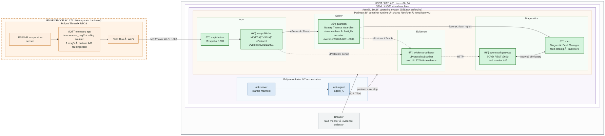

# Solution Plan

## Team overview

### FEVengers Assemble!

Our roster comprises software developers from FEV.io and FEV Turkey:

| Name | Git Handle | Experience | Responsibility |
| ---- | -------- | -------- | -------- |
| Ashwin Prakash Kadayil | Kadayil | Embedded Systems, HPC, Software Architecture | Hacking |
| Michael Luxen | FEVLuM | In-Vehicle Networks, Diagnostics, Embedded Software | Hacking |
| Sinan Cidem | CidemSinan | Software Developer, Embedded Engineering, Ankaios, AUTOSAR | Hacking |
| Irem Isik Erol  | isik-i  | VCU Integration, AUTOSAR, DevOps | Hacking |
| Alexander Mödder | MoedderAlex | Simulation, Network Communication, DevOps | Project Management |

### The Villain of the day:

**Doctor Whodunnit!**

### Our Attack Plan

We began with a brainstorming session to outline the overall architecture, which served as a foundation for further development. This approach allowed us to quickly identify missing APIs and dependencies, enabling us to parallelize exploration tasks across the team.

The resulting architecture is as follows:

## How do we work?

### The Development Process

**Task Tracking**
- **Issues**: We track all tasks and work items through GitHub .

**Branching Strategy**
- **Main Branch**: Contains production-ready code and releases. All pushes require a pull request.
- **Integration Branch**: Central branch where work flows together and merge conflicts are resolved. All pushes require a pull request.
- **User Branches**: Each team member maintains their own branch for continuous work on their assigned tasks and features.

## Quality Assurance

**Code Reviews**
- **During Pull Requests**: All branches merged into the integration branch require a code review.

**Testing**
- **Unit tests**: We plan to get coverage for as many components as we can.

**Documentation**
- **Shared**: Each team member is responsible for documenting their own work when creating new features or updating existing functionality.
- **Up-to-date**: This ensures documentation remains current and accurate throughout development.

## Communication

- **Excalidraw**: Initial architecture brainstorming and design discussions
- **Slack**: Real-time communication while working on development tasks
- **WhatsApp**: Coordination outside of the workplace
- **GitHub**: Code collaboration, pull request discussions, and issue tracking

## Decision making

- **Popular vote**: We cannot tie with 5 people

