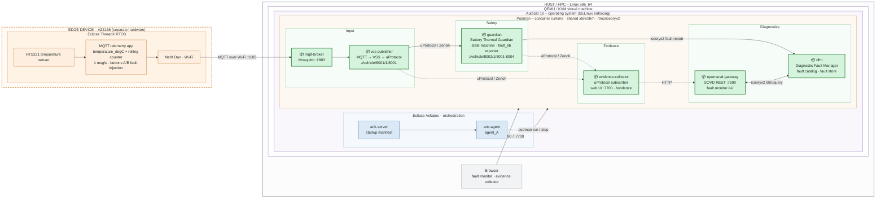

<!-- Created with AI assistance (Claude Opus 5.5, Anthropic). -->

# Static View

```mermaid
flowchart LR
  subgraph EDGE["EDGE DEVICE – AZ3166 (separate hardware)"]
    direction TB
    subgraph RTOS["Eclipse ThreadX RTOS"]
      direction TB
      SENS["HTS221 temperature sensor"]
      FW["MQTT telemetry app<br/>temperature_degC + rolling counter<br/>1 msg/s · buttons A/B fault injection"]
      NET["NetX Duo · Wi-Fi"]
      SENS --> FW --> NET
    end
  end

  subgraph HPC["HOST / HPC – Linux x86_64"]
    direction TB
    BROWSER["Browser<br/>fault monitor · evidence collector"]

    subgraph QEMU["QEMU / KVM virtual machine"]
      direction TB
      subgraph AUTOSD["AutoSD 10 – operating system (SELinux enforcing)"]
        direction TB

        subgraph ANK["Eclipse Ankaios – orchestration"]
          direction LR
          ANKS["ank-server<br/>startup manifest"] --> ANKA["ank-agent<br/>agent_A"]
        end

        subgraph PODMAN["Podman – container runtime · shared /dev/shm · /tmp/iceoryx2"]
          direction TB
          subgraph INPUT["Input"]
            direction TB
            MQB["📦 mqtt-broker<br/>Mosquitto :1883"]
            VSS["📦 vss-publisher<br/>MQTT → VSS → uProtocol<br/>//vehicle/8001/1/8001"]
          end
          subgraph SAFETY["Safety"]
            GRD["📦 guardian<br/>Battery Thermal Guardian<br/>state machine · fault_lib reporter<br/>//vehicle/8002/1/8001-8004"]
          end
          subgraph DIAG["Diagnostics"]
            direction TB
            DFM["📦 dfm<br/>Diagnostic Fault Manager<br/>fault catalog · fault store"]
            SOVD["📦 opensovd-gateway<br/>SOVD REST :7690<br/>fault monitor /ui/"]
          end
          subgraph EVID["Evidence"]
            EVC["📦 evidence-collector<br/>uProtocol subscriber<br/>web UI :7700 · /evidence"]
          end
        end

        ANKA -->|"podman run / stop"| PODMAN
      end
    end
  end

  NET -->|"MQTT over Wi-Fi :1883"| MQB
  MQB --> VSS
  VSS -->|"uProtocol / Zenoh"| GRD
  GRD -->|"iceoryx2 fault report"| DFM
  SOVD <-->|"iceoryx2 dfm/query"| DFM
  GRD -.->|"uProtocol / Zenoh"| EVC
  VSS -.->|"uProtocol / Zenoh"| EVC
  EVC -.->|"HTTP"| SOVD
  BROWSER -->|"HTTP :7690 / :7700"| PODMAN

  classDef box fill:#d4f4dd,stroke:#2e7d32,stroke-width:2px,color:#1f2a24;
  classDef ank fill:#dbe9f7,stroke:#1f5f99,color:#1f2a24;
  classDef edge fill:#fdeee0,stroke:#c26a12,color:#1f2a24;
  classDef host fill:#f1f3f4,stroke:#9aa3ab,color:#1f2a24;
  class MQB,VSS,GRD,DFM,SOVD,EVC box;
  class ANKS,ANKA ank;
  class SENS,FW,NET edge;
  class BROWSER host;
  style EDGE fill:#fffaf4,stroke:#c26a12,stroke-width:2px,stroke-dasharray:6 4
  style RTOS fill:#fff3e6,stroke:#e0a060
  style HPC fill:#fcfcfc,stroke:#7f8a94,stroke-width:2px
  style QEMU fill:#ffffff,stroke:#b9a6d3,stroke-width:1.5px
  style AUTOSD fill:#f9f6fc,stroke:#8a6bb5,stroke-width:1.5px
  style ANK fill:#f5f9fd,stroke:#a9c6e3
  style PODMAN fill:#fdf8f1,stroke:#e2bf93,stroke-width:1.5px
  style INPUT fill:#f6fcf7,stroke:#8cc79a
  style SAFETY fill:#f6fcf7,stroke:#8cc79a
  style DIAG fill:#f6fcf7,stroke:#8cc79a
  style EVID fill:#f6fcf7,stroke:#8cc79a
```
