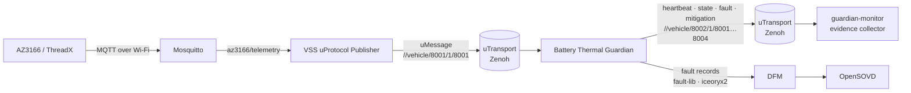
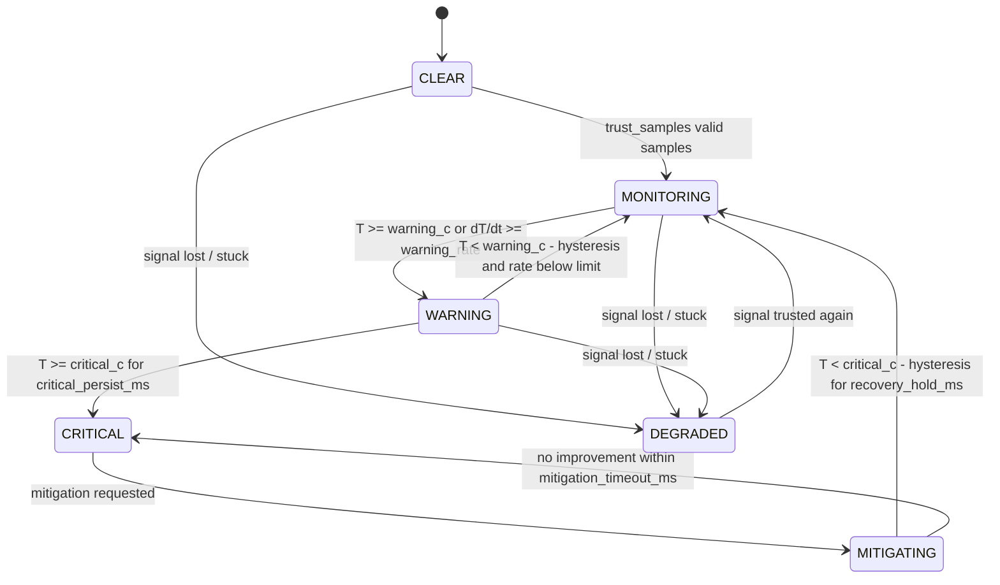

<!--
Copyright (c) 2026 FEVengers contributors

This program and the accompanying materials are made available under the
terms of the Eclipse Public License 2.0 which is available at
https://www.eclipse.org/legal/epl-2.0

AI Disclosure: This file was largely AI-generated by Claude Code (Opus 5.5).
The AI-generated portions may be considered public domain (CC0-1.0)
and not subject to the project's licence. The human contributor has
reviewed the code and verified it with the included tests.

SPDX-License-Identifier: EPL-2.0 AND CC0-1.0
-->

# Battery Thermal Guardian

EV thermal-runaway early-warning service. It receives the battery temperature
as a VSS signal **over uProtocol** (never from the Data Broker directly),
checks whether the signal can be trusted, runs the thermal risk state machine
and publishes **heartbeat, state, fault and mitigation** events over uProtocol.

Code: [`battery-thermal-guardian/`](../battery-thermal-guardian/)

## Where it sits



The [VSS uProtocol Publisher](vss-uprotocol-publisher.md) turns the board's
MQTT readings into uProtocol messages. The Guardian only ever sees uProtocol.

## Faults

Every fault is published on the uProtocol fault topic (RAISED / CLEARED).
The four faults of the DFM catalog
[`dfm-container/battery_guardian_catalog.json`](../dfm-container/battery_guardian_catalog.json)
(catalog id `battery`) are also reported to the DFM
(see [DFM reporting](#dfm-reporting)).

| Fault | DFM catalog id | Class | Meaning | To DFM |
|---|---|---|---|---|
| `TempSourceConnectionLost` | `btg.src.connection_lost` | Source | No accepted temperature sample within the timeout (board, Wi-Fi or MQTT link lost) | yes |
| `TempOutOfRange` | `btg.temp.out_of_range` | Signal | Temperature outside the physically plausible range | yes |
| `TempSignalStuck` | `btg.temp.stuck` | Signal | Temperature value frozen for longer than allowed | yes |
| `TempSignalSpike` | `btg.temp.spike` | Signal | Implausible jump between samples, not confirmed by the next one | yes |
| `TransportDelay` | – | Transport | Sample arrived later than the allowed end-to-end latency | no |
| `TransportDuplicate` | – | Transport | Same rolling counter as the previous sample | no |
| `TransportOutOfOrder` | – | Transport | Sample older than one already received | no |
| `PayloadInvalid` | – | Transport | Message is not a valid VSS sample | no |

How each fault is detected and what it does to the state machine:
[Signal integrity](#signal-integrity).

## Run the full chain

All commands run from the repository root.

**1. Build both programs** (release builds are much smaller and faster than debug):

```sh
(cd battery-thermal-guardian && cargo build --release)
(cd vss-uprotocol-publisher && cargo build --release)
```

**2. Start the chain**, one terminal each:

```sh
# MQTT broker
docker run --rm --name mosquitto -p 1883:1883 eclipse-mosquitto:2 mosquitto -c /mosquitto-no-auth.conf

# Guardian
battery-thermal-guardian/target/release/guardian -c battery-thermal-guardian/config/guardian.toml

# Guardian events, one JSON line each, also saved to a file
battery-thermal-guardian/target/release/guardian-monitor --no-heartbeat | tee events.jsonl

# Publisher; the correlation id tags every event of this run
vss-uprotocol-publisher/target/release/vss-uprotocol-publisher -c vss-uprotocol-publisher/config/publisher.toml --correlation-id run-001
```

**Optional: DFM.** To get the catalog faults into the Diagnostic Fault
Manager as well, start the DFM ([DFM bring-up](DFM_BRINGUP.md)) with the
folder `C` that contains `battery_guardian_catalog.json` mounted at
`/catalogs`. Then start the Guardian (instead of the
`guardian` command above) with the same iceoryx2 options and the same catalog:

```sh
podman build -t battery-thermal-guardian -f battery-thermal-guardian/Containerfile battery-thermal-guardian
podman run --rm --net=host --ipc=host --pid=host --user 0:0 \
  -v /dev/shm:/dev/shm -v /tmp/iceoryx2:/tmp/iceoryx2 -v $C:/catalogs:ro \
  battery-thermal-guardian --config /etc/guardian/guardian.toml \
  --dfm-catalog /catalogs/battery_guardian_catalog.json
```

On AutoSD add `--security-opt label=disable`. The Guardian also starts
without the DFM and connects as soon as it is up (see
[DFM reporting](#dfm-reporting)).

**3. Feed it data**: either the real AZ3166 (it publishes to the broker's
address on port 1883), or a recorded MQTT log with one JSON message per line,
sent at one message per second:

```sh
while IFS= read -r line; do echo "$line"; sleep 1; done < mqtt_log.txt \
  | docker exec -i mosquitto mosquitto_pub -t az3166/telemetry -l
```

A log taken with `mosquitto_sub -v` has the topic in front of each message;
strip it first with `cut -d' ' -f2- mqtt_log.txt`. Replaying at a fixed 1 Hz
keeps repeated counters but not gaps in the original recording.

**What to expect** in the monitor: `CLEAR → MONITORING` after three valid
readings. If the Guardian waits more than 3 s for the first reading, it first
reports `TempSourceConnectionLost` and goes to DEGRADED, then returns to
MONITORING when data arrives. When the replay ends, `TempSourceConnectionLost`
follows again after 3 s.

### Without the board or the publisher

`vss-sim` (part of the [publisher](vss-uprotocol-publisher.md#simulated-source-vss-sim))
stands in for the board and the publisher: it publishes a temperature profile
on the publisher's topic, optionally with one fault injected between
`--fault-start-s` (10) and `--fault-end-s` (25). It only sends VSS samples and
does not depend on the Guardian.

```sh
battery-thermal-guardian/target/release/guardian -c battery-thermal-guardian/config/demo.toml
battery-thermal-guardian/target/release/guardian-monitor -c battery-thermal-guardian/config/demo.toml --no-heartbeat
vss-uprotocol-publisher/target/release/vss-sim overheat -c vss-uprotocol-publisher/config/publisher.toml \
  --correlation-id run-001 > injection.jsonl
```

`config/demo.toml` shortens the Guardian's stuck window and mitigation timeout
so each scenario shows its effect within about a minute. `injection.jsonl`
records when the fault was injected; together with the Guardian's events it
gives the detection latency.

### As a container (Podman / Ankaios workload)

```sh
podman build -t battery-thermal-guardian -f battery-thermal-guardian/Containerfile battery-thermal-guardian
podman run --rm --net=host battery-thermal-guardian
```

With DFM reporting, the container needs the iceoryx2 options and the catalog;
the full command is at the top of the
[`Containerfile`](../battery-thermal-guardian/Containerfile).

### If the monitor shows nothing

The programs find each other through Zenoh multicast scouting, which VPNs,
corporate networks or WSL2 can block. Connect them through a fixed address
instead. Create `zenoh-listen.json5`:

```json5
{ mode: "peer", listen: { endpoints: ["tcp/127.0.0.1:7447"] }, scouting: { multicast: { enabled: false } } }
```

and `zenoh-connect.json5`:

```json5
{ mode: "peer", connect: { endpoints: ["tcp/127.0.0.1:7447"] }, scouting: { multicast: { enabled: false } } }
```

Start the Guardian first with `--zenoh-config zenoh-listen.json5`, then the
monitor, the publisher, `vss-sim` and `vss-listen` with
`--zenoh-config zenoh-connect.json5`.

## State machine



With the defaults: WARNING at 55 °C or a rise of 0.5 °C/s over 10 s, CRITICAL
after 65 °C for 2 s, recovery below 62 °C for 5 s, mitigation timeout 30 s.

`DEGRADED` extends the suggested state machine from the challenge README. A
lost or stuck temperature must not leave the Guardian quietly in MONITORING,
because that would turn off the warning chain without anyone noticing.
Instead the Guardian raises a fault and requests a fallback mitigation.

CRITICAL and MITIGATING stay latched when the signal is lost. An active
mitigation is not released just because the evidence went away, and the
mitigation timeout keeps running, so it can still escalate.

| Mitigation | When |
|---|---|
| `REDUCE_POWER_MAX_COOLING` | first CRITICAL |
| `OCCUPANT_EVACUATION_WARNING` | mitigation failed (re-asserted on every further timeout) |
| `MONITORING_UNAVAILABLE_WARNING` | DEGRADED |

All active mitigations are `RELEASED` when the condition improves or the signal
becomes trusted again.

The decision core is pure: no I/O and no clock; time is an input. The same
sample sequence always produces the same events, which keeps fault campaigns
replayable.

## Signal integrity

Each sample passes these checks in order. A sample that fails a check is
discarded and raises a fault. The fault clears after `heal_samples` accepted
samples in a row. Discarded samples **do not refresh signal freshness**, so a
stream that stays bad (delayed, out of range, spiking) ends in
`TempSourceConnectionLost` and DEGRADED.

| Fault | Detection | Effect |
|---|---|---|
| `TransportDuplicate` | same `rolling_counter` as previous | sample discarded |
| `TransportOutOfOrder` | older `rolling_counter` / send time | sample discarded |
| `TransportDelay` | arrival − uMessage creation time > `max_latency_ms` | sample discarded |
| `TempOutOfRange` | outside `[min_c, max_c]` or NaN | sample discarded |
| `TempSignalSpike` | rate > `max_rate_c_per_s`, not confirmed by next sample | sample discarded |
| `TempSignalStuck` | value unchanged for `stuck_window_ms` | **DEGRADED** |
| `TempSourceConnectionLost` | no accepted sample for `stale_timeout_ms` | **DEGRADED** |
| `PayloadInvalid` | payload is not a `VssSample`, or no UUIDv7 message id | message discarded |

Fault events carry the DFM catalog id in `catalog_id` (`null` for the
transport faults, see [Faults](#faults)).

A fast change that the next sample confirms is accepted, not filtered. Real
thermal runaway can rise very quickly, and a spike filter must not hide it.

Ordering uses the device's `rolling_counter`, which wraps (`counter_modulus`,
256 for the AZ3166: 255 → 0). A counter less than half the range ahead is
newer, otherwise older:

| previous → new counter | Guardian sees |
|---|---|
| 254 → 254 | duplicate |
| 254 → 255, 255 → 0 | next reading |
| 254 → 1 | next reading, 2 counted as `missing` |
| 5 → 3, sent earlier | out of order |
| 120 → 0, sent later | device restart: accepted, counting continues from 0 |

Gaps are counted as `missing` in the heartbeat. A board whose counter has
frozen produces only duplicates, so no sample is accepted and the Guardian
raises `TempSourceConnectionLost` and goes to DEGRADED.

## uProtocol contract

All payloads are `UPAYLOAD_FORMAT_JSON`; the structs are in
[`src/contract.rs`](../battery-thermal-guardian/src/contract.rs).

**Address plan** (service IDs from the uProtocol vendor range `0x8000–0xFFFE`):

| Component | authority | service ID | instance | version | topics |
|---|---|---|---|---|---|
| VSS uProtocol Publisher | `vehicle` | `0x8001` | 0 | 1 | `0x8001` temperature |
| Battery Thermal Guardian | `vehicle` | `0x8002` | 0 | 1 | `0x8001` heartbeat, `0x8002` state, `0x8003` fault, `0x8004` mitigation |

The authority name is a placeholder until the team picks one; both components
must use the same.

**Input**: `//*/8001/1/8001` (configurable)

```json
{"path": "Vehicle.Powertrain.TractionBattery.Temperature.Max",
 "value": 41.7, "rolling_counter": 210, "correlation_id": "run-001"}
```

The sample time is the creation time of the uMessage: its id is a UUIDv7,
which records when the publisher built it (read with `UUID::get_time()`).
`rolling_counter` is the device's counter (+1 per reading, wraps to 0);
`correlation_id` is optional. Both are echoed in the `trigger` of every event
the sample triggers. The heartbeat reports the `rolling_counter` of the last
accepted sample.

**Output**

| Resource | Topic | Payload |
|---|---|---|
| 0x8001 | heartbeat (every `heartbeat_period_ms`) | `seq, state, at_ms, uptime_ms, temperature_c, rolling_counter, signal_age_ms, active_faults, active_mitigations, counters` |
| 0x8002 | state | `seq, from, to, reason, at_ms, trigger` |
| 0x8003 | fault | `seq, fault, catalog_id, class, status (RAISED/CLEARED), detail, state, at_ms, trigger` |
| 0x8004 | mitigation | `seq, action, status (REQUESTED/RELEASED), reason, at_ms, trigger` |

`seq` on state/fault/mitigation is one Guardian-wide counter, numbered by the
Guardian itself (it has nothing to do with the input). Zenoh does not
order messages across topics, so evidence should be ordered by `seq`.
`at_ms` is the Guardian's time when the event happened. `trigger` points back
to the input sample: its `rolling_counter`, `sent_ms` (when the publisher
created the uMessage), `value`, uProtocol `message_id` and
`correlation_id`. Time-driven events such as `TempSourceConnectionLost` have
no trigger. Detection latency is the event's `at_ms` minus the injection time,
e.g. the `fault_start` record of
[`vss-sim`](vss-uprotocol-publisher.md#simulated-source-vss-sim).

## DFM reporting

Faults with a catalog id are reported to the Diagnostic Fault Manager with
Eclipse OpenSOVD [fault-lib](https://github.com/eclipse-opensovd/fault-lib).
It is on when a catalog is configured (`[dfm] catalog` or `--dfm-catalog`);
the file must be the same one the DFM loads.

- [`src/faults.rs`](../battery-thermal-guardian/src/faults.rs) is the DFM
  side: one fault-lib reporter per catalog fault, entity path = catalog id
  `battery`, reports only on a state change.
- [`src/dfm.rs`](../battery-thermal-guardian/src/dfm.rs) connects it to the
  Guardian:

| Guardian fault | faults.rs | RAISED / CLEARED |
|---|---|---|
| `TempSourceConnectionLost` | `ConnectionLost` (`btg.src.connection_lost`) | `Failed` / `Passed` |
| `TempOutOfRange` | `OutOfRange` (`btg.temp.out_of_range`) | `Failed` / `Passed` |
| `TempSignalStuck` | `Stuck` (`btg.temp.stuck`) | `Failed` / `Passed` |
| `TempSignalSpike` | `Spike` (`btg.temp.spike`) | `Failed` / `Passed` |
| transport faults, `PayloadInvalid` | – (not in the catalog) | not reported |

- **Connection**: on connect, fault-lib checks the catalog hash with the DFM,
  so a DFM with another version of the catalog is refused. While the DFM is
  not reachable, the Guardian keeps working, retries every `retry_period_ms`
  and remembers the latest state of each fault; after connecting it reports
  those, so the DFM catches up with the current state.
- faults.rs runs on its own thread, so a slow or missing DFM never delays the
  Guardian's decisions or its uProtocol events.
- DFM records carry no test-run data (faults.rs sends no environment data).
  To link a DFM record to a run, use the uProtocol fault event of the same
  fault and time: it carries `correlation_id` and the triggering sample.
- The Guardian starts with all faults inactive and reports only changes. If
  the DFM still holds a `Failed` fault from an earlier run, it stays `Failed`
  until the fault occurs and clears again, so clear the DFM's fault memory at
  the start of each campaign run.
- The Guardian is built against fault-lib revision `12dac50`; the DFM must
  use the same revision (catalog hash and IPC format).

## Configuration

[`config/guardian.toml`](../battery-thermal-guardian/config/guardian.toml)
lists every option with its default.
[`config/demo.toml`](../battery-thermal-guardian/config/demo.toml) shortens the
stuck and mitigation windows for demos. Unknown keys are rejected. `-c` selects
the file, `--zenoh-config` a Zenoh configuration, `--dfm-catalog` the DFM
catalog. Logging is controlled by
`RUST_LOG` (e.g. `RUST_LOG=debug`) and goes to stderr.

## Development

Building needs `clang` and `libclang-dev`: iceoryx2, which fault-lib uses,
generates its bindings with bindgen. Tests need no broker, no Zenoh, no DFM
and no network:

```sh
cd battery-thermal-guardian && cargo test
```

- [`tests/guardian_core.rs`](../battery-thermal-guardian/tests/guardian_core.rs):
  the decision core with simulated time; every state transition and fault
  class, latching, event numbering and deterministic replay.
- [`tests/uprotocol_service.rs`](../battery-thermal-guardian/tests/uprotocol_service.rs):
  the service end to end with real uMessages over up-rust's in-process
  `LocalTransport` instead of Zenoh.
- [`tests/fault_catalog.rs`](../battery-thermal-guardian/tests/fault_catalog.rs):
  fault names and ids against `dfm-container/battery_guardian_catalog.json`,
  so the tests need the whole repository.
- Unit tests in [`src/dfm.rs`](../battery-thermal-guardian/src/dfm.rs): every
  catalog fault maps to the faults.rs fault with the same id; RAISED/CLEARED
  to active/not active. The connection to a running DFM is not part of
  `cargo test`.

No local Rust toolchain? Use the official Rust image with libclang added:

```sh
printf 'FROM docker.io/library/rust:1-bookworm\nRUN apt-get update && apt-get install -y clang libclang-dev\n' \
  | docker build -t rust-clang -
alias cargo='docker run --rm -it --net=host -u "$(id -u):$(id -g)" -e CARGO_HOME=/w/target/cargo-home -v "$PWD":/w -w /w rust-clang cargo'
```

## Not yet covered

- Only the four catalog faults reach the DFM. Transport faults, state
  changes, mitigations and heartbeats are only published over uProtocol
  (seen by `guardian-monitor`); getting them into the DFM is still open and
  needs new entries in the DFM catalog.
- Readings that MQTT delivers back to back after a Wi-Fi hiccup are sent
  milliseconds apart and can trip the spike check.
- Arrival order of messages that come in back to back is not guaranteed:
  up-transport-zenoh hands every received message to the listener in its own
  task. Such messages can be swapped inside the Guardian (possible false
  `TransportOutOfOrder`) or a real swap can be undone.
- Drift detection needs a second, redundant temperature signal.
- Latency checks need publisher and Guardian clocks to agree (same host or NTP).
