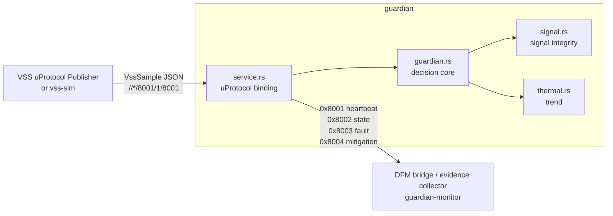
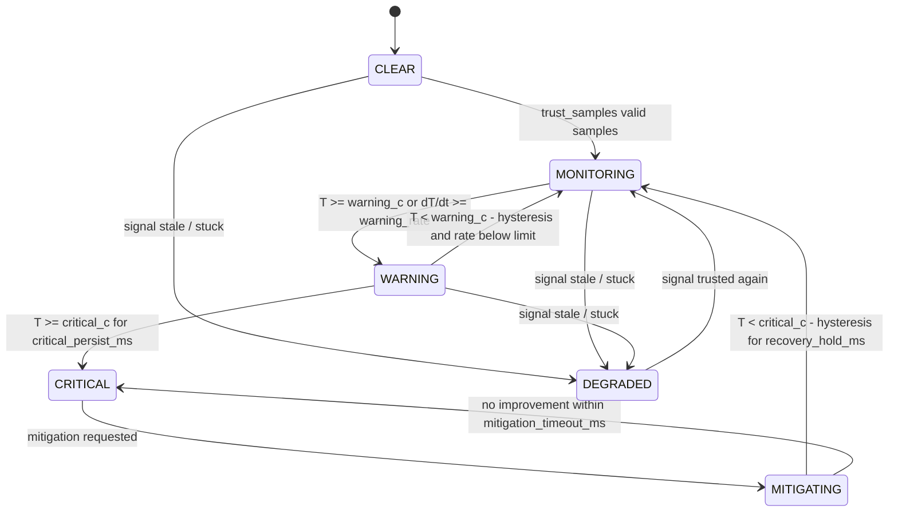

<!--
Copyright (c) 2026 FEVengers contributors

This program and the accompanying materials are made available under the
terms of the Eclipse Public License 2.0 which is available at
https://www.eclipse.org/legal/epl-2.0

AI Disclosure: This file was largely AI-generated by Claude Code (Opus 5.5).
The AI-generated portions may be considered public domain (CC0-1.0)
and not subject to the project's licence. The human contributor has
reviewed the code and verified it with the included tests.

SPDX-License-Identifier: EPL-2.0 AND CC0-1.0
-->

# Battery Thermal Guardian

EV thermal-runaway early-warning service. It receives the battery temperature
as a VSS signal **over uProtocol** (never from the Data Broker directly),
checks whether the signal can be trusted, runs the thermal risk state machine
and publishes **heartbeat, state, fault and mitigation** events over uProtocol.

Diagrams of the state machine, the per-sample checks and the timers, with
every transition condition: [Docs/guardian-state-machine.html](Docs/guardian-state-machine.html)
(open the file in a browser; GitHub shows HTML files as source).



The decision core is pure: no I/O, no clock, time is an input. The same sample
sequence always produces the same events, which keeps fault campaigns
replayable and makes the core testable without a transport.

## Quick start

```sh
cargo test
```

No local Rust toolchain? Use the official Rust image instead:

```sh
alias cargo='docker run --rm -it --net=host -u "$(id -u):$(id -g)" -e CARGO_HOME=/w/target/cargo-home -v "$PWD":/w -w /w rust:1-bookworm cargo'
```

Three terminals (Zenoh peer mode, multicast scouting; all on the same host):

```sh
cargo run --bin guardian -- -c config/demo.toml
cargo run --bin guardian-monitor -- -c config/demo.toml --no-heartbeat > events.jsonl
cargo run --bin vss-sim -- overheat -c config/demo.toml --correlation-id run-001
```

`vss-sim` scenarios: `nominal`, `overheat`, `runaway`, `stuck`, `spike`,
`out-of-range`, `dropout`, `delay`, `duplicate`, `reorder`. The fault is active
between `--fault-start-s` (10) and `--fault-end-s` (25). `vss-sim` only stands in for the
VSS publisher during development; it does not replace the campaign runner.

Container (Podman / Ankaios workload):

```sh
podman build -t battery-thermal-guardian -f Containerfile .
podman run --rm --net=host battery-thermal-guardian
```

## State machine



`DEGRADED` extends the suggested state machine from the challenge README. A
stale or stuck temperature must not leave the Guardian quietly in MONITORING,
because that would turn off the warning chain without anyone noticing.
Instead the Guardian raises a fault and requests a fallback mitigation.

CRITICAL and MITIGATING stay latched when the signal is lost. An active
mitigation is not released just because the evidence went away, and the
mitigation timeout keeps running, so it can still escalate.

| Mitigation | When |
|---|---|
| `REDUCE_POWER_MAX_COOLING` | first CRITICAL |
| `OCCUPANT_EVACUATION_WARNING` | mitigation failed (re-asserted on every further timeout) |
| `MONITORING_UNAVAILABLE_WARNING` | DEGRADED |

All active mitigations are `RELEASED` when the condition improves or the signal
becomes trusted again.

## Signal integrity

Each sample passes these checks in order. A sample that fails a check is
discarded and raises a fault. The fault clears after `heal_samples` accepted
samples in a row. Discarded samples **do not refresh signal freshness**, so a
stream that stays bad (delayed, out of range, spiking) ends in
`TempSourceConnectionLost` and DEGRADED.

| Fault | DFM catalog id | Class | Detection | Effect |
|---|---|---|---|---|
| `TransportDuplicate` | – | Transport | same `seq` as previous | sample discarded |
| `TransportOutOfOrder` | – | Transport | older `seq` / send time | sample discarded |
| `TransportDelay` | – | Transport | arrival − uMessage creation time > `max_latency_ms` | sample discarded |
| `TempOutOfRange` | `btg.temp.out_of_range` | Signal | outside `[min_c, max_c]` or NaN | sample discarded |
| `TempSignalSpike` | `btg.temp.spike` | Signal | rate > `max_rate_c_per_s`, not confirmed by next sample | sample discarded |
| `TempSignalStuck` | `btg.temp.stuck` | Signal | value unchanged for `stuck_window_ms` | **DEGRADED** |
| `TempSourceConnectionLost` | `btg.src.connection_lost` | Source | no accepted sample for `stale_timeout_ms` | **DEGRADED** |
| `PayloadInvalid` | – | Transport | payload is not a `VssSample` | message discarded |

Fault names and ids match the DFM fault catalog
[`dfm-container/battery_guardian_catalog.json`](../dfm-container/battery_guardian_catalog.json)
(catalog `battery`). Fault events carry the id in `catalog_id`. The transport
faults are Guardian-internal: they are published on the fault topic with
`catalog_id: null` and are not meant to be forwarded to the DFM.

A fast change that the next sample confirms is accepted, not filtered. Real
thermal runaway can rise very quickly, and a spike filter must not hide it.

Gaps in `seq` are counted as `missing` in the heartbeat. A lower `seq` with a
newer send time is treated as a publisher restart, not as reordering.

## uProtocol contract

Guardian uEntity: authority `vehicle`, ID `0x8002`, version 1. All payloads are
`UPAYLOAD_FORMAT_JSON`; see [src/contract.rs](src/contract.rs).

**Input**: `//*/8001/1/8001` (configurable)

```json
{"path": "Vehicle.Powertrain.TractionBattery.Temperature.Max",
 "value": 41.7, "seq": 1234, "rolling_counter": 210, "correlation_id": "run-001"}
```

The sample time is the creation time of the uMessage: its id is a UUIDv7,
which records when the
[VSS uProtocol Publisher](../vss-uprotocol-publisher/README.md) built it
(read with `UUID::get_time()`). A message without such an id is reported as
`PayloadInvalid`. `seq` increments by one per sample. `rolling_counter` (the
device's alive counter) and `correlation_id` are optional. Both are echoed in
the `trigger` of every event the sample triggers. The heartbeat reports the
`rolling_counter` of the last accepted sample.

**Output**

| Resource | Topic | Payload |
|---|---|---|
| 0x8001 | heartbeat (every `heartbeat_period_ms`) | `seq, state, at_ms, uptime_ms, temperature_c, rolling_counter, signal_age_ms, active_faults, active_mitigations, counters` |
| 0x8002 | state | `seq, from, to, reason, at_ms, trigger` |
| 0x8003 | fault | `seq, fault, catalog_id, class, status (RAISED/CLEARED), detail, state, at_ms, trigger` |
| 0x8004 | mitigation | `seq, action, status (REQUESTED/RELEASED), reason, at_ms, trigger` |

`seq` on state/fault/mitigation is one Guardian-wide counter. Zenoh does not
order messages across topics, so evidence should be ordered by `seq`.
`at_ms` is the Guardian's time when the event happened. `trigger` points back
to the input sample: its `seq`, `sent_ms` (when the publisher created the
uMessage), `value`, `rolling_counter`, uProtocol `message_id` and
`correlation_id`. Time-driven events such as `TempSourceConnectionLost` have
no trigger. Detection latency is the event's `at_ms` minus the injection time
recorded by the campaign runner.

## Configuration

[config/guardian.toml](config/guardian.toml) lists every option with its
default. [config/demo.toml](config/demo.toml) shortens the stuck and
mitigation windows so demos stay short. Unknown keys are rejected. Logging is
controlled by `RUST_LOG` and goes to stderr.

## Tests

- [tests/guardian_core.rs](tests/guardian_core.rs): behavior of the core for
  every state transition and fault class, latching, event numbering, and
  deterministic replay.
- [tests/uprotocol_service.rs](tests/uprotocol_service.rs): the service end to
  end over up-rust's in-process `LocalTransport`, so real uProtocol messages and
  no Zenoh.

## Not yet covered

- DFM fault records / OpenSOVD: fault events carry the DFM catalog id
  (`catalog_id`), but there is no `fault_lib`/iceoryx2 reporter yet.
- Drift detection needs a second, redundant temperature signal.
- Latency checks need publisher and Guardian clocks to agree (same host or NTP).
