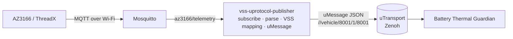

<!--
Copyright (c) 2026 FEVengers contributors

This program and the accompanying materials are made available under the
terms of the Eclipse Public License 2.0 which is available at
https://www.eclipse.org/legal/epl-2.0

AI Disclosure: This file was largely AI-generated by Claude Code (Opus 5.5).
The AI-generated portions may be considered public domain (CC0-1.0)
and not subject to the project's licence. The human contributor has
reviewed the code and verified it with the included tests.

SPDX-License-Identifier: EPL-2.0 AND CC0-1.0
-->

# VSS uProtocol Publisher

Bridges the AZ3166 temperature readings from MQTT to uProtocol. It subscribes
to the MQTT topic, maps `temperature_degC` from each message to a VSS signal
and publishes it as a uMessage that the
[Battery Thermal Guardian](battery-thermal-guardian.md) consumes. The board's
`counter` is not a VSS signal: it travels unchanged in the same message as an
extra field (`rolling_counter`).

Code: [`vss-uprotocol-publisher/`](../vss-uprotocol-publisher/)

## Where it sits



The publisher only translates. It forwards implausible values unchanged,
because judging them is the Guardian's job. Filtering here would hide
exactly the faults the Guardian must detect. It publishes one uMessage per
MQTT message, as soon as it arrives; it has no timer of its own.

## Run

From the repository root:

```sh
(cd vss-uprotocol-publisher && cargo build --release)

docker run --rm --name mosquitto -p 1883:1883 eclipse-mosquitto:2 mosquitto -c /mosquitto-no-auth.conf
vss-uprotocol-publisher/target/release/vss-uprotocol-publisher -c vss-uprotocol-publisher/config/publisher.toml
```

Send one reading by hand:

```sh
docker exec mosquitto mosquitto_pub -t az3166/telemetry \
  -m '{"temperature_degC": 24.65, "counter": 1}'
```

### Check the output without the Guardian

`vss-listen` subscribes to the publisher's topic (`//*/8001/1/8001`) and
prints every uMessage it receives as one JSON line. This shows the whole path
MQTT → publisher → uProtocol/Zenoh without starting the Guardian:

```sh
vss-uprotocol-publisher/target/release/vss-listen -c vss-uprotocol-publisher/config/publisher.toml
```

```json
{"rx_ms":1791359107942,"sent_ms":1791359107942,"latency_ms":0,"source":"//vehicle/8001/1/8001",
 "message_id":"01a11552-c366-718e-9044-547572d96e05",
 "sample":{"path":"Vehicle.Powertrain.TractionBattery.Temperature.Max","value":24.62,"rolling_counter":2,"correlation_id":"run-001"}}
```

`sent_ms` is the creation time from the uMessage id, `latency_ms` the time
until it arrived. In the publisher itself, `RUST_LOG=info,vss_uprotocol_publisher=debug`
logs every published sample, and `reading dropped` warnings show MQTT messages
that could not be mapped. If `vss-listen` shows nothing, see
[If the monitor shows nothing](battery-thermal-guardian.md#if-the-monitor-shows-nothing)
(Zenoh discovery). From the container image:
`podman run --rm --net=host --entrypoint vss-listen vss-uprotocol-publisher`.

To run it together with the Guardian and replay a recorded MQTT log, see
[Run the full chain](battery-thermal-guardian.md#run-the-full-chain).

With the real board, point the AZ3166 at the broker's address on port 1883,
or start the publisher with `--mqtt-host <broker address>` if the broker runs
elsewhere. If the broker is not reachable, the publisher retries every second.

As a container (Podman / Ankaios workload):

```sh
podman build -t vss-uprotocol-publisher -f vss-uprotocol-publisher/Containerfile vss-uprotocol-publisher
podman run --rm --net=host vss-uprotocol-publisher --mqtt-host 192.168.1.10
```

## Input: MQTT

Topic `az3166/telemetry` (configurable), one JSON object per second:

```json
{"pressure_hPa":1215.87,"temperature_degC":24.65,"humidity_perc":54.11,
 "acceleration_mg":[-38.43,13.85,1011.26],"magnetic_mG":[-91.50,-99.00,-384.00],
 "counter":31}
```

Two keys are used; their names are set in `[mapping]` (`temperature_field`,
`counter_field`):

| Key | Accepted |
|---|---|
| `temperature_degC` | number or numeric string, degrees Celsius |
| `counter` | non-negative integer (or numeric string), +1 per message, 255 wraps to 0 |

All other keys are ignored. The publisher drops a message and logs a warning
if the payload is not a JSON object or a key is missing or invalid.

## Output: uProtocol

uMessage of type PUBLISH, source `//vehicle/8001/1/8001`, payload format
`UPAYLOAD_FORMAT_JSON`:

```json
{"path": "Vehicle.Powertrain.TractionBattery.Temperature.Max",
 "value": 24.65, "rolling_counter": 31, "correlation_id": "run-001"}
```

This is the Guardian's `VssSample` contract
([`battery-thermal-guardian/src/contract.rs`](../battery-thermal-guardian/src/contract.rs)).
The publisher's address is part of the
[address plan](battery-thermal-guardian.md#uprotocol-contract).

- **Sample time**: the uMessage id is a UUIDv7, which records when the
  publisher created the message; the Guardian uses that as the sample time.
  Delay between the board and the broker is therefore not visible: the
  Guardian's latency check covers publisher → Guardian only.
- **`rolling_counter`**: the board's counter, passed through unchanged. The
  publisher keeps no state between messages. The Guardian judges the counter
  (duplicates, reordering, lost readings, wrap-around 255 → 0); see
  [Signal integrity](battery-thermal-guardian.md#signal-integrity).

## Configuration

[`config/publisher.toml`](../vss-uprotocol-publisher/config/publisher.toml)
lists every option with its default. `--mqtt-host`, `--zenoh-config` and
`--correlation-id` override the file. Logging is controlled by `RUST_LOG`
(`debug` shows every published sample) and goes to stderr.

## Development

Tests need no broker and no Zenoh:

```sh
cd vss-uprotocol-publisher && cargo test
```

- [`tests/mapping.rs`](../vss-uprotocol-publisher/tests/mapping.rs): MQTT
  payload to VSS sample with a real board message, error cases and the
  counter pass-through; `output_matches_guardian_input_contract` pins the
  JSON the Guardian expects.
- [`tests/uprotocol.rs`](../vss-uprotocol-publisher/tests/uprotocol.rs): the
  published uMessage on up-rust's in-process `LocalTransport`.

## Current limits

- Readings that MQTT delivers back to back after a Wi-Fi hiccup become
  uMessages milliseconds apart and can trip the Guardian's spike check.
