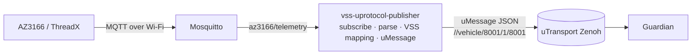

<!--
Copyright (c) 2026 FEVengers contributors

This program and the accompanying materials are made available under the
terms of the Eclipse Public License 2.0 which is available at
https://www.eclipse.org/legal/epl-2.0

AI Disclosure: This file was largely AI-generated by Claude Code (Opus 5.5).
The AI-generated portions may be considered public domain (CC0-1.0)
and not subject to the project's licence. The human contributor has
reviewed the code and verified it with the included tests.

SPDX-License-Identifier: EPL-2.0 AND CC0-1.0
-->

# VSS uProtocol Publisher

Bridges the AZ3166 temperature readings from MQTT to uProtocol. It subscribes
to the MQTT topic, maps `temperature_degC` from each message to a VSS signal
and publishes it as a uMessage that the
[Battery Thermal Guardian](../battery-thermal-guardian/README.md) consumes.
The board's `counter` is not a VSS signal: it travels in the same message as
an extra field (`rolling_counter`), and the publisher derives `seq` from it.

Diagrams of the message flow, the counter-to-`seq` rule and the MQTT
connection loop: [Docs/vss-uprotocol-publisher.html](Docs/vss-uprotocol-publisher.html)
(open the file in a browser; GitHub shows HTML files as source).



The publisher only translates. It forwards implausible values unchanged,
because judging them is the Guardian's job. Filtering here would hide
exactly the faults the Guardian must detect.

## Quick start

```sh
cargo test
cargo run -- -c config/publisher.toml --correlation-id run-001
```

Try it without the board:

```sh
docker run -d --rm --name mosquitto --net=host eclipse-mosquitto:2
docker exec mosquitto mosquitto_pub -t az3166/telemetry \
  -m '{"temperature_degC": 24.65, "counter": 1}'
```

Container (Podman / Ankaios workload):

```sh
podman build -t vss-uprotocol-publisher -f Containerfile .
podman run --rm --net=host vss-uprotocol-publisher --mqtt-host 192.168.1.10
```

## Input: MQTT

Topic `az3166/telemetry` (configurable), JSON object:

```json
{"pressure_hPa":1215.87,"temperature_degC":24.65,"humidity_perc":54.11,
 "acceleration_mg":[-38.43,13.85,1011.26],"magnetic_mG":[-91.50,-99.00,-384.00],
 "counter":31}
```

One message per second. Two keys are used; their names are set in
`[mapping]` (`temperature_field`, `counter_field`):

| Key | Accepted |
|---|---|
| `temperature_degC` | number or numeric string, degrees Celsius |
| `counter` | non-negative integer (or numeric string), +1 per message, 255 wraps to 0 |

All other keys are ignored. The publisher drops a message and logs a warning
if the payload is not a JSON object or a key is missing or invalid.

## Output: uProtocol

uMessage of type PUBLISH, source `//vehicle/8001/1/8001`, payload format
`UPAYLOAD_FORMAT_JSON`:

```json
{"path": "Vehicle.Powertrain.TractionBattery.Temperature.Max",
 "value": 24.65, "seq": 9, "rolling_counter": 31, "correlation_id": "run-001"}
```

This is the Guardian's `VssSample` contract (`battery-thermal-guardian/src/contract.rs`).
The test `output_matches_guardian_input_contract` pins the format.

- Sample time: the uMessage id is a UUIDv7, which records when the publisher
  created the message; the Guardian uses that as the sample time. Delay
  between the board and the broker is therefore not visible: the Guardian's
  latency check covers publisher → Guardian only. Repeated readings are
  detected through `counter` (see `seq`).
- `rolling_counter`: the device counter as received. The Guardian reports the
  counter of the last accepted sample in its heartbeat.
- `seq`: increments whenever `counter` changes, wrap-around included.
  When the same counter arrives again, the sample keeps its `seq`. That covers
  both an MQTT QoS 1 re-delivery and a device whose counter has frozen. The
  Guardian then reports `TransportDuplicate` instead of treating the sample as
  fresh data. If the counter stays frozen, the Guardian raises
  `TempSourceConnectionLost` and goes to `DEGRADED`.

The uMessage ID (UUIDv7) is set by up-rust; the Guardian copies it into every
event the sample triggers.

## Configuration

[config/publisher.toml](config/publisher.toml) lists every option with its
default. `--mqtt-host`, `--zenoh-config` and `--correlation-id` override the
file. Logging is controlled by `RUST_LOG` (`debug` shows every published
sample) and goes to stderr. If the broker is not reachable, the publisher
retries every second.
