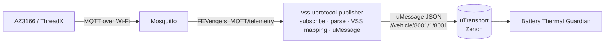

<!--
Copyright (c) 2026 FEVengers contributors

This program and the accompanying materials are made available under the
terms of the Eclipse Public License 2.0 which is available at
https://www.eclipse.org/legal/epl-2.0

AI Disclosure: This file was largely AI-generated by Claude Code (Opus 5.5).
The AI-generated portions may be considered public domain (CC0-1.0)
and not subject to the project's licence. The human contributor has
reviewed the code and verified it with the included tests.

SPDX-License-Identifier: EPL-2.0 AND CC0-1.0
-->

# VSS uProtocol Publisher

Bridges the AZ3166 temperature readings from MQTT to uProtocol. It subscribes
to the MQTT topic, maps `temperature_degC` from each message to a VSS signal
and publishes it as a uMessage that the
[Battery Thermal Guardian](battery-thermal-guardian.md) consumes. The board's
`counter` is not a VSS signal: it travels unchanged in the same message as an
extra field (`rolling_counter`).

Code: [`vss-uprotocol-publisher/`](../vss-uprotocol-publisher/)

## Where it sits



The publisher only translates. It forwards implausible values unchanged,
because judging them is the Guardian's job. Filtering here would hide
exactly the faults the Guardian must detect. It publishes one uMessage per
MQTT message, as soon as it arrives; it has no timer of its own.

## Run

There are the same two setups as for the Guardian (see
[Run the full chain](battery-thermal-guardian.md#run-the-full-chain)); do not
run both at once, both use port 1883 on this machine.

### On AutoSD (reference setup)

The publisher runs as the Ankaios workload `vss-publisher`, next to the
`mqtt-broker` workload, both with the host network
([`deploy/ankaios-manifest.yaml`](../deploy/ankaios-manifest.yaml)). It
connects to the broker at `localhost:1883`, the default in
[`config/publisher.toml`](../vss-uprotocol-publisher/config/publisher.toml). It
is built and deployed with the rest of the system, see
[On AutoSD](battery-thermal-guardian.md#on-autosd-reference-setup).

The AZ3166 publishes to `<this machine's Wi-Fi IP>:1883`; QEMU forwards it to
the broker in AutoSD. To check the publisher there:

```sh
# Send one reading by hand from this machine (port 1883 is forwarded)
mosquitto_pub -h localhost -p 1883 -t FEVengers_MQTT/telemetry \
  -m '{"temperature_degC": 24.65, "counter": 1}'

# Inside AutoSD: the publisher's log, and the uMessages it sends
./autosd/autosd.sh ssh
podman ps                                   # name of the vss-publisher container
podman logs -f <vss-publisher container>
podman run --rm --net=host --entrypoint vss-listen localhost/vss-uprotocol-publisher:dev \
  -c /etc/vss-uprotocol-publisher/publisher.toml
```

### On one machine (development)

From the repository root:

```sh
(cd vss-uprotocol-publisher && cargo build --release)

# MQTT broker in the background (-d); its log: docker logs -f mosquitto
docker run -d --rm --name mosquitto -p 1883:1883 eclipse-mosquitto:2 mosquitto -c /mosquitto-no-auth.conf

# Publisher in the foreground (Ctrl-C stops it); debug shows every published sample
RUST_LOG=info,zenoh=warn,vss_uprotocol_publisher=debug \
  vss-uprotocol-publisher/target/release/vss-uprotocol-publisher -c vss-uprotocol-publisher/config/publisher.toml
```

The publisher logs `connected to MQTT broker`. Send one reading by hand from
a second terminal:

```sh
docker exec mosquitto mosquitto_pub -t FEVengers_MQTT/telemetry \
  -m '{"temperature_degC": 24.65, "counter": 1}'
```

The publisher then logs `publish sample=VssSample { ..., rolling_counter: 1, ... }`.
Lines like `New client connected from ::1 ...` in the broker log are normal:
that is `mosquitto_pub` (or the publisher) connecting. Stop the broker with
`docker stop mosquitto`.

To run it together with the Guardian and replay a recorded MQTT log, see
[On one machine](battery-thermal-guardian.md#on-one-machine-development).

With the real board, point the AZ3166 at this machine's address on port 1883,
or start the publisher with `--mqtt-host <broker address>` if the broker runs
elsewhere. If the broker is not reachable, the publisher retries every second.

As a container (arguments after the image name replace its default command,
so pass `--config` too):

```sh
podman build -t vss-uprotocol-publisher -f vss-uprotocol-publisher/Containerfile vss-uprotocol-publisher
podman run --rm --net=host vss-uprotocol-publisher \
  --config /etc/vss-uprotocol-publisher/publisher.toml --mqtt-host 192.168.1.10
```

### Check the output without the Guardian

`vss-listen` subscribes to the publisher's topic (`//*/8001/1/8001`) and
prints every uMessage it receives as one JSON line. This shows the whole path
MQTT → publisher → uProtocol/Zenoh without starting the Guardian:

```sh
vss-uprotocol-publisher/target/release/vss-listen -c vss-uprotocol-publisher/config/publisher.toml
```

```json
{"rx_ms":1791359107942,"sent_ms":1791359107942,"latency_ms":0,"source":"//vehicle/8001/1/8001",
 "message_id":"01a11552-c366-718e-9044-547572d96e05",
 "sample":{"path":"Vehicle.Powertrain.TractionBattery.Temperature.Max","value":24.62,"rolling_counter":2,"correlation_id":"run-001"}}
```

`sent_ms` is the creation time from the uMessage id, `latency_ms` the time
until it arrived. In the publisher itself, `RUST_LOG=info,zenoh=warn,vss_uprotocol_publisher=debug`
logs every published sample, and `reading dropped` warnings show MQTT messages
that could not be mapped. If `vss-listen` shows nothing, see
[If the monitor shows nothing](battery-thermal-guardian.md#if-the-monitor-shows-nothing)
(Zenoh discovery). From the container image:
`podman run --rm --net=host --entrypoint vss-listen vss-uprotocol-publisher -c /etc/vss-uprotocol-publisher/publisher.toml`.

### Simulated source (vss-sim)

`vss-sim` replaces the board and the publisher: it publishes a temperature
profile as `VssSample`s on the publisher's topic (same config file), with an
optional fault injected between `--fault-start-s` (default 10) and
`--fault-end-s` (25). It only sends VSS samples and knows nothing about the
Guardian.

```sh
vss-uprotocol-publisher/target/release/vss-sim stuck -c vss-uprotocol-publisher/config/publisher.toml \
  --correlation-id run-001 > injection.jsonl
```

| Scenario | Class | What vss-sim does | Guardian reaction (observed with `config/demo.toml`) |
|---|---|---|---|
| `nominal` | – | stable ~30 °C | MONITORING, no faults |
| `overheat` | thermal | ramp to 72 °C, hold, cool down | WARNING → CRITICAL → MITIGATING (`REDUCE_POWER_MAX_COOLING`). demo.toml's 10 s mitigation timeout expires during the hold, so the Guardian goes back to CRITICAL (mitigation failed) and MITIGATING again; after cooling back to MONITORING, mitigations released |
| `runaway` | thermal | ramp to 72 °C and keep rising | WARNING → CRITICAL → MITIGATING; every `mitigation_timeout_ms` back to CRITICAL (mitigation failed) and MITIGATING again |
| `stuck` | Signal | the device repeats its last reading in the fault window (rolling counter and value frozen) | `TempSignalStuck` after `stuck_window_ms` (3 s) → DEGRADED, `MONITORING_UNAVAILABLE_WARNING`; cleared when the counter increases again |
| `spike` | Signal | every 4th sample +40 °C in the fault window | `TempSignalSpike`, spiked samples discarded, state unchanged; cleared after 5 good samples |
| `out-of-range` | Signal | 200 °C in the fault window | `TempOutOfRange`; no sample is accepted, so after 3 s DEGRADED because of `TempOutOfRange` |
| `dropout` | Source | nothing sent in the fault window | `TempSourceConnectionLost` after 3 s → DEGRADED; cleared by the next message |
| `delay` | Transport | samples sent 2 s late in the fault window (the uMessage keeps its creation time) | delayed samples discarded; no usable sample for 3 s → DEGRADED, `MONITORING_UNAVAILABLE_WARNING`; back to MONITORING after the window |
| `duplicate` | Transport | every sample sent twice in the fault window | duplicates discarded, state unchanged |
| `reorder` | Transport | consecutive samples swapped in the fault window | older sample discarded, state unchanged; not every swapped pair is recognized |

Times are from runs with the fault window at 4–12 s. Every fault clears
after the window; DEGRADED returns to MONITORING.

Other options: `--rate-hz` (2), `--duration-s` (90), `--zenoh-config`. Each
sample carries an 8-bit `rolling_counter` like the board's.

**Injection record**: stdout gets one JSON line per event, logs go to stderr:

```json
{"record":"run_start","at_ms":1791359100000,"scenario":"stuck","correlation_id":"run-001","topic":"//vehicle/8001/1/8001",...}
{"record":"fault_start","at_ms":1791359110000,"scenario":"stuck","correlation_id":"run-001"}
{"record":"fault_end","at_ms":1791359125000,"scenario":"stuck","correlation_id":"run-001"}
{"record":"run_end","at_ms":1791359192200,"scenario":"stuck","correlation_id":"run-001"}
```

`at_ms` is wall-clock time like the Guardian's event `at_ms`, so detection
latency = Guardian fault event `at_ms` − `fault_start` `at_ms`. The temperature
profiles (`nominal`, `overheat`, `runaway`) have no fault window and only
write `run_start` and `run_end`. From the container image:
`podman run --rm --net=host --entrypoint vss-sim vss-uprotocol-publisher stuck -c /etc/vss-uprotocol-publisher/publisher.toml`.

`vss-sim` is a development aid; it does not replace the fault campaign runner.
To run it with the Guardian, see
[Without the board or the publisher](battery-thermal-guardian.md#without-the-board-or-the-publisher).

## Input: MQTT

Topic `FEVengers_MQTT/telemetry` (configurable), one JSON object per second:

```json
{"temperature_degC": 24.65, "counter": 31}
```

This is what the board's firmware sends ([`az3166-firmware.md`](az3166-firmware.md)).

Two keys are used; their names are set in `[mapping]` (`temperature_field`,
`counter_field`):

| Key | Accepted |
|---|---|
| `temperature_degC` | number or numeric string, degrees Celsius |
| `counter` | non-negative integer (or numeric string), +1 per message, 255 wraps to 0 |

All other keys are ignored. The publisher drops a message and logs a warning
if the payload is not a JSON object or a key is missing or invalid.

## Output: uProtocol

uMessage of type PUBLISH, source `//vehicle/8001/1/8001`, payload format
`UPAYLOAD_FORMAT_JSON`:

```json
{"path": "Vehicle.Powertrain.TractionBattery.Temperature.Max",
 "value": 24.65, "rolling_counter": 31, "correlation_id": "run-001"}
```

This is the Guardian's `VssSample` contract
([`battery-thermal-guardian/src/contract.rs`](../battery-thermal-guardian/src/contract.rs)).
The publisher's address is part of the
[address plan](battery-thermal-guardian.md#uprotocol-contract).

- **Sample time**: the uMessage id is a UUIDv7, which records when the
  publisher created the message; the Guardian uses that as the sample time.
  Delay between the board and the broker is therefore not visible: the
  Guardian's latency check covers publisher → Guardian only.
- **`rolling_counter`**: the board's counter, passed through unchanged. The
  publisher keeps no state between messages. The Guardian judges the counter
  (duplicates, reordering, lost readings, wrap-around 255 → 0); see
  [Signal integrity](battery-thermal-guardian.md#signal-integrity).

## Configuration

[`config/publisher.toml`](../vss-uprotocol-publisher/config/publisher.toml)
lists every option with its default. `--mqtt-host`, `--zenoh-config` and
`--correlation-id` override the file. `vss-listen` and `vss-sim` read the same
file (`[uprotocol]` for the topic, `[mapping] vss_path` for vss-sim), so they
always use the publisher's topic. Logging is controlled by `RUST_LOG`
(`info,zenoh=warn,vss_uprotocol_publisher=debug` shows every published sample) and goes
to stderr.

## Development

Tests need no broker and no Zenoh:

```sh
cd vss-uprotocol-publisher && cargo test
```

- [`tests/mapping.rs`](../vss-uprotocol-publisher/tests/mapping.rs): MQTT
  payload to VSS sample with a real board message, error cases and the
  counter pass-through; `output_matches_guardian_input_contract` pins the
  JSON the Guardian expects.
- [`tests/uprotocol.rs`](../vss-uprotocol-publisher/tests/uprotocol.rs): the
  published uMessage on up-rust's in-process `LocalTransport`.

`vss-listen` and `vss-sim` (`src/bin/`) are test tools and have no tests of
their own.
