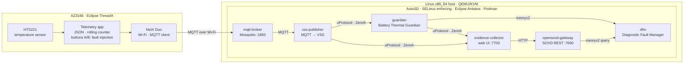

<!--
Copyright (c) 2026 FEVengers contributors

This program and the accompanying materials are made available under the
terms of the Eclipse Public License 2.0 which is available at
https://www.eclipse.org/legal/epl-2.0

AI Disclosure: This file was largely AI-generated by Claude Code (Opus 5.5).
The AI-generated portions may be considered public domain (CC0-1.0)
and not subject to the project's licence. The human contributor has
reviewed it.

SPDX-License-Identifier: EPL-2.0 AND CC0-1.0
-->

# Battery Thermal Guardian · Safety Evidence Factory

*Every fault leaves evidence.* A safety evidence factory around an EV
thermal-runaway early-warning service, built from Eclipse SDV projects and
running on AutoSD. By team FEVengers (FEV.io × FEV Türkiye).

## The problem

An EV battery that starts to run away thermally gives a short warning
window: occupants have to be warned before the event turns dangerous. The
service that gives this warning depends on a single input, the cell
temperature. If that signal is lost, frozen or implausible, the warning
service does not fail loudly. It keeps reporting "all fine" on stale data,
and the whole warning chain is silently disarmed.

Detecting this is only half of the job. A safety argument also needs
**evidence**: for every fault, what was injected, what the service observed,
which mitigation it requested, what ended up in the vehicle's diagnostics,
and whether all of that matches what was expected.

## Our solution

We built a **safety evidence factory** around a **Battery Thermal Guardian**:
a chain that produces temperature data, injects faults into it, detects them,
reacts to them, records them as diagnostics and documents every run as
evidence. The stages are built on Eclipse SDV projects:

| Stage | Component | Built on | Docs |
|---|---|---|---|
| Source | AZ3166 board: temperature sensor, MQTT telemetry, fault injection buttons | Eclipse ThreadX, Eclipse Mosquitto | [AZ3166 firmware](Docs/az3166-firmware.md) |
| Publish | VSS uProtocol publisher: MQTT reading → VSS signal → uMessage | Eclipse uProtocol, Eclipse Zenoh | [VSS uProtocol publisher](Docs/vss-uprotocol-publisher.md) |
| Evaluate | Battery Thermal Guardian: signal trust checks, thermal state machine, mitigations | Eclipse uProtocol, Eclipse Zenoh | [Battery Thermal Guardian](Docs/battery-thermal-guardian.md) |
| Diagnose | Diagnostic Fault Manager and SOVD REST gateway | Eclipse OpenSOVD, Eclipse iceoryx | [DFM](Docs/DFM_BRINGUP.md), [OpenSOVD gateway](Docs/opensovd-gateway-dfm.md), [fault chain](Docs/FAULT_CHAIN.md) |
| Collect | Evidence collector: independent judge, one evidence folder per run | Eclipse uProtocol, Eclipse Zenoh | [Evidence collector](Docs/evidence-collector.md) |
| Run | Every service as a container on the vehicle OS | AutoSD, Eclipse Ankaios, Podman | [AutoSD setup](Docs/AutosdSetup.md), [build and deploy](Docs/BUILD_IMAGES.md) |

The Guardian reports four faults and requests two mitigations
([details](Docs/battery-thermal-guardian.md#faults)):

| Fault | Meaning |
|---|---|
| `TempSourceConnectionLost` | No data: no message within 3 s (board, Wi-Fi or MQTT link lost) |
| `TempSignalStuck` | Data arrives, but the board's rolling counter does not increase |
| `TempOutOfRange` | Temperature outside the plausible range (−40 … 150 °C) |
| `TempSignalSpike` | Implausible jump between samples, not confirmed by the next one |

| Mitigation | When |
|---|---|
| `REDUCE_POWER_MAX_COOLING` | Temperature ≥ 65 °C for 2 s (CRITICAL) |
| `MONITORING_UNAVAILABLE_WARNING` | Signal untrusted (DEGRADED): the Guardian cannot judge the battery and says so instead of staying silent |

## Architecture



The Guardian only ever sees uProtocol: VSS data reaches it through the
publisher's uProtocol service interface, never from a broker directly. It
does not know about the evidence collector, which only listens.

## Workflow

### One temperature reading

1. The AZ3166 reads the HTS221 sensor once per second and publishes
   `{"temperature_degC": …, "counter": …}` over MQTT. The `counter` is an
   8-bit rolling counter, +1 per reading
   ([firmware](Docs/az3166-firmware.md)).
2. Mosquitto receives it; the **VSS publisher** maps it to the VSS signal
   `Vehicle.Powertrain.TractionBattery.Temperature.Max` and publishes it as a
   uMessage on `//vehicle/8001/1/8001`
   ([publisher](Docs/vss-uprotocol-publisher.md#output-uprotocol)).
3. The **Guardian** checks whether the reading can be trusted (order, delay,
   range, spike, frozen counter, missing data), then runs the thermal state
   machine CLEAR → MONITORING → WARNING → CRITICAL → MITIGATING, or DEGRADED
   when the signal is untrusted ([signal integrity](Docs/battery-thermal-guardian.md#signal-integrity),
   [state machine](Docs/battery-thermal-guardian.md#state-machine)).
4. It publishes heartbeat, state, fault and mitigation events over uProtocol
   (`//vehicle/8002/1/8001…8004`), each linked to the reading that caused it
   ([uProtocol contract](Docs/battery-thermal-guardian.md#uprotocol-contract)).
5. Every raised or cleared catalog fault also goes to the **DFM** (fault-lib
   over iceoryx2), which keeps the diagnostic fault memory
   ([DFM reporting](Docs/battery-thermal-guardian.md#dfm-reporting), [DFM](Docs/DFM_BRINGUP.md)).
6. The **OpenSOVD gateway** serves that fault memory over SOVD REST
   ([OpenSOVD gateway](Docs/opensovd-gateway-dfm.md), [fault chain](Docs/FAULT_CHAIN.md)).
7. The **evidence collector** receives both the raw readings and the
   Guardian's events, and builds one evidence row per fault
   ([evidence collector](Docs/evidence-collector.md)).

### One evidence run

1. Open the evidence collector ([web UI](Docs/evidence-collector.md#5-web-ui)) and press **Start evidence**.
2. Inject a fault with the buttons on the board (see [fault injection](#fault-injection)).
3. The Guardian detects it, changes state and requests a mitigation; the
   fault appears in the DFM and on the SOVD gateway.
4. Press **Stop**. The run is written to its own folder:
   `events.jsonl` (every uProtocol message), `faults.json` (evidence rows),
   `summary.json` (counts, SOVD fault list before and after),
   `report.md` (readable table); see [evidence folder](Docs/evidence-collector.md#6-evidence-folder).

Each evidence row holds the value before and after the fault, its rate, the
Guardian's state and reason, and the collector's own limit check
(✔ confirmed / ✖ not seen). The collector takes these values from its own
copy of the raw stream and its own limits, not from the Guardian.

### Fault injection

The board's buttons inject faults into the temperature and the rolling
counter it publishes. A fault is active only while the button is held; see
the [AZ3166 firmware](Docs/az3166-firmware.md#buttons-fault-injection).

| Held | Board sends | Guardian reaction |
|---|---|---|
| A | value and counter frozen (STUCK) | Every repeat is a `TransportDuplicate`; `TempSignalStuck` after 3 s → DEGRADED, `MONITORING_UNAVAILABLE_WARNING` |
| B | nothing (DROPOUT) | `TempSourceConnectionLost` after 3 s → DEGRADED, `MONITORING_UNAVAILABLE_WARNING` |
| A + B | +20 °C per reading up to 160 °C, then held (OUT OF RANGE) | Each step is faster than 10 °C/s and is discarded as `TempSignalSpike`; above 150 °C the readings are discarded as `TempOutOfRange`. No reading accepted for 3 s → DEGRADED, `MONITORING_UNAVAILABLE_WARNING` |
| Board off / Wi-Fi lost | nothing | `TempSourceConnectionLost` after 3 s → DEGRADED, `MONITORING_UNAVAILABLE_WARNING` |

The Guardian discards the injected readings, so none of the buttons drives
it to WARNING or CRITICAL. To show that path, send a slow rise instead, for
example with `vss-sim` ([without the board](Docs/battery-thermal-guardian.md#without-the-board-or-the-publisher)).

### Build and deploy

Every service is compiled inside a container and shipped as an OCI image.
The same image runs on an Ubuntu laptop and on AutoSD; only the run options
differ (SELinux, IPv4-only Zenoh). How the images are built and started:
[build and deploy](Docs/BUILD_IMAGES.md); how the containers moved from
Ubuntu to AutoSD: [Podman migration](Docs/PODMAN_MIGRATION.md).

```text
code ──cargo test──► build-images.sh ──OCI images──► deploy-to-autosd.sh ──► Ankaios starts the workloads
```

## Eclipse SDV projects

The same list is in [`.sdv-blueprint.json`](.sdv-blueprint.json).

| Project | ID | Used for |
|---|---|---|
| [Eclipse ThreadX](https://projects.eclipse.org/projects/iot.threadx) | `iot.threadx` | RTOS on the AZ3166: sensor sampling, MQTT telemetry, button fault injection |
| [Eclipse Mosquitto](https://projects.eclipse.org/projects/iot.mosquitto) | `iot.mosquitto` | MQTT broker receiving the board's Wi-Fi telemetry |
| [Eclipse uProtocol](https://projects.eclipse.org/projects/automotive.uprotocol) | `automotive.uprotocol` | Service contract: VSS signal in; heartbeat, state, fault and mitigation out |
| [Eclipse Zenoh](https://projects.eclipse.org/projects/iot.zenoh) | `iot.zenoh` | uProtocol transport between publisher, Guardian and evidence collector |
| [Eclipse iceoryx](https://projects.eclipse.org/projects/technology.iceoryx) | `technology.iceoryx` | Zero-copy shared-memory IPC (iceoryx2): Guardian → DFM, DFM ↔ SOVD gateway |
| [Eclipse OpenSOVD](https://projects.eclipse.org/projects/automotive.opensovd) | `automotive.opensovd` | fault-lib, Diagnostic Fault Manager, SOVD gateway (ISO 17978) |
| [Eclipse Ankaios](https://projects.eclipse.org/projects/automotive.ankaios) | `automotive.ankaios` | Workload orchestration: desired state, restart on failure, start at boot |
| [Eclipse Automotive Integration for AutoSD](https://projects.eclipse.org/projects/automotive.autosd) | `automotive.autosd` | Automotive Linux target/runtime image for running and testing the orchestrated SDV stack |

## Dependencies

**On the build machine** only a container engine (Podman or Docker) is
needed: all services are compiled inside containers, no Rust toolchain on the
host (`./deploy/install-build-deps.sh`).

| Component | Language | Main dependencies | Image |
|---|---|---|---|
| [`vss-uprotocol-publisher`](vss-uprotocol-publisher/) | Rust | `up-rust` 0.9, `up-transport-zenoh` 0.9.1, `rumqttc` 0.25, `tokio` | `rust:1.99.0-bookworm` → `debian:bookworm-slim` |
| [`battery-thermal-guardian`](battery-thermal-guardian/) | Rust | `up-rust` 0.9, `up-transport-zenoh` 0.9.1, OpenSOVD `fault-lib` (commit `12dac50`, iceoryx2; build needs `clang`/`libclang`) | `rust:1.99.0-bookworm` → `debian:bookworm-slim` |
| [`evidence-collector`](evidence-collector/) | Rust | `up-rust` 0.9, `up-transport-zenoh` 0.9.1, `axum` 0.7, `reqwest` 0.12 | `rust:1.99.0-bookworm` → `debian:bookworm-slim` |
| [`dfm-container`](dfm-container/) | Rust | OpenSOVD `fault-lib` (`dfm_bin`), built from source | `rust:1.99.0-bookworm` → `debian:bookworm-slim` |
| [`opensovd-gateway-dfm`](opensovd-gateway-dfm/) | Rust | OpenSOVD `opensovd-core` (commit `1bf4c47`) with `fault-lib` (`12dac50`), built from source | `rust:1.99.0-bookworm` → `debian:bookworm-slim` |
| mqtt-broker | – | Eclipse Mosquitto 2 | `eclipse-mosquitto:2` |
| [`az3166-firmware`](az3166-firmware/) | C | Eclipse ThreadX and NetX Duo (git submodules), the MXChip AZ3166 folder of `eclipse-threadx/samplex` with our application `FEVengersApp` | – (flashed to the board) |

The Rust services share one contract: the payloads in
[`battery-thermal-guardian/src/contract.rs`](battery-thermal-guardian/src/contract.rs)
and the DFM fault catalog [`catalogs/battery_guardian_catalog.json`](catalogs/battery_guardian_catalog.json),
which the Guardian, the DFM and the gateway load from the same file.

## Runtime environments

| Environment | What runs there | Requirements |
|---|---|---|
| **Edge device** | AZ3166 with the ThreadX firmware | Same Wi-Fi as the host; broker address = host's Wi-Fi IP, port 1883, compiled into the firmware ([firmware](Docs/az3166-firmware.md), [MQTT data from the board](Docs/AutosdSetup.md#mqtt-data-from-the-board)) |
| **Host** | QEMU/KVM with the AutoSD image; image build | Linux x86_64 (tested: Ubuntu 22.04), KVM, QEMU, OVMF, OpenSSH ≥ 8.4, Podman or Docker ([details](Docs/AutosdSetup.md#2-programs-on-your-machine)) |
| **Target** | AutoSD (bootc QEMU image) with Ankaios (`ank-server`, `ank-agent`) and Podman; the workloads `mqtt-broker`, `vss-publisher`, `guardian`, `dfm`, `opensovd-gateway` and the evidence collector | SELinux enforcing (`label=disable` for shared mounts); host network for Zenoh; `--ipc=host`, `--pid=host`, `/dev/shm` and `/tmp/iceoryx2` shared for iceoryx2 between `guardian`, `dfm` and `opensovd-gateway`; IPv4-only Zenoh configuration ([Ankaios manifest](Docs/BUILD_IMAGES.md#4-ankaios-manifest)) |
| **Development** | Publisher, Guardian and a Mosquitto container directly on one Linux machine, without AutoSD | Rust toolchain, `clang`/`libclang` for the Guardian ([how](Docs/battery-thermal-guardian.md#on-one-machine-development)) |

Network between host and target (QEMU port forwards, see [ports](Docs/AutosdSetup.md#ports)):

| Host port | Target | Used for |
|---|---|---|
| 2222 | SSH 22 | Shell and deployment scripts |
| 1883 | Mosquitto | MQTT from the board |
| 7690 | OpenSOVD gateway | SOVD REST and fault monitor page |
| 7700 | Evidence collector | Evidence web UI and REST |

## Getting started

From the repository root, on a new machine (Ubuntu), one command takes a
fresh clone to the running system. It installs the packages, downloads the
AutoSD image into [`autosd/`](autosd/), boots it, installs Ankaios, builds
the images and starts the six workloads:

```sh
./deploy/setup-all.sh           # every step that is not done yet
./deploy/setup-all.sh --check   # only report, change nothing
```

The same steps one by one ([what each does](Docs/AutosdSetup.md)):

```sh
./deploy/install-host-deps.sh    # once: QEMU, OVMF, ..., container engine
./autosd/autosd.sh setup         # once: download the AutoSD image
./autosd/autosd.sh start         # start AutoSD with the port forwards
./deploy/setup-autosd.sh         # once: install Ankaios in the image
./deploy/build-images.sh         # build all service images
./deploy/deploy-to-autosd.sh     # load them, start the workloads, keep them across reboots
```

Then flash the board with the host's Wi-Fi address as broker
([firmware](Docs/az3166-firmware.md); `./autosd/autosd.sh status` prints the
address) and open:

| What | Where |
|---|---|
| Evidence collector | `http://localhost:7700/` |
| DFM faults over SOVD | `http://localhost:7690/ui/`, REST `http://localhost:7690/sovd/v1/apps/battery/faults` |
| Empty the fault memory before a run | `./deploy/deploy-to-autosd.sh clear-faults` |

Details: [AutoSD setup](Docs/AutosdSetup.md),
[build and deploy](Docs/BUILD_IMAGES.md),
[AZ3166 firmware](Docs/az3166-firmware.md),
[fault chain](Docs/FAULT_CHAIN.md),
[Guardian](Docs/battery-thermal-guardian.md),
[publisher](Docs/vss-uprotocol-publisher.md),
[evidence collector](Docs/evidence-collector.md),
[OpenSOVD gateway](Docs/opensovd-gateway-dfm.md).

Tests of the Rust services need no broker, network or DFM:
`(cd battery-thermal-guardian && cargo test)`, `(cd vss-uprotocol-publisher && cargo test)`.

## Repository layout

| Path | Content | Docs |
|---|---|---|
| [`az3166-firmware/`](az3166-firmware/) | Firmware of the AZ3166 board (`app/FEVengersApp`); ThreadX and NetX Duo as submodules | [AZ3166 firmware](Docs/az3166-firmware.md) |
| [`vss-uprotocol-publisher/`](vss-uprotocol-publisher/) | MQTT → VSS → uProtocol publisher; test tool `vss-listen` | [Publisher](Docs/vss-uprotocol-publisher.md) |
| [`battery-thermal-guardian/`](battery-thermal-guardian/) | The Guardian; test tool `guardian-monitor` | [Guardian](Docs/battery-thermal-guardian.md) |
| [`evidence-collector/`](evidence-collector/) | Evidence collector with web UI | [Evidence collector](Docs/evidence-collector.md) |
| [`dfm-container/`](dfm-container/) | OpenSOVD Diagnostic Fault Manager image | [DFM](Docs/DFM_BRINGUP.md) |
| [`opensovd-gateway-dfm/`](opensovd-gateway-dfm/) | OpenSOVD gateway with the DFM faults and the fault monitor page | [OpenSOVD gateway](Docs/opensovd-gateway-dfm.md) |
| [`catalogs/`](catalogs/) | DFM fault catalog of the Guardian | [Fault chain](Docs/FAULT_CHAIN.md) |
| [`config/`](config/) | Zenoh configurations (fixed address instead of multicast discovery) | [Guardian](Docs/battery-thermal-guardian.md#if-the-monitor-shows-nothing) |
| [`deploy/`](deploy/) | Image build, Ankaios manifest, deployment to AutoSD | [Build and deploy](Docs/BUILD_IMAGES.md), [Podman migration](Docs/PODMAN_MIGRATION.md) |
| [`autosd/`](autosd/) | Start and manage the AutoSD QEMU image | [AutoSD setup](Docs/AutosdSetup.md) |
| [`fault-campaign-runner/`](fault-campaign-runner/) | Placeholder service | – |
| [`Docs/`](Docs/) | Documentation of every component and of the setup; the first SOVD fault bridge, replaced by the OpenSOVD gateway, is kept for reference | [SOVD fault bridge](Docs/SOVD_Bridge_Fault.md) |

## Team

| Name | GitHub | Focus |
|---|---|---|
| Ashwin Prakash Kadayil | [@Kadayil](https://github.com/Kadayil) | Embedded systems, HPC, software architecture |
| Michael Luxen | [@FEVLuM](https://github.com/FEVLuM) | In-vehicle networks, diagnostics, embedded software |
| Sinan Cidem | [@CidemSinan](https://github.com/CidemSinan) | Ankaios, AUTOSAR, embedded engineering |
| Irem Isik Erol | [@isik-i](https://github.com/isik-i) | VCU integration, AUTOSAR, DevOps |
| Alexander Mödder | [@MoedderAlex](https://github.com/MoedderAlex) | Simulation, network communication, project management |

We worked in Scrum on GitHub: every task is an issue; branches `USER/<name>` →
`Integration` → `main`, every merge through a reviewed pull request
([solution plan](Docs/SolutionPlan.md)).

## License

Eclipse Public License 2.0, see [LICENSE](LICENSE).

Large parts of the code and documentation were written with AI assistance
(Claude Code); each such file says so in its header. The AI-generated portions
may be considered public domain (CC0-1.0); the human contributors reviewed
them and verified the code with the included tests.

Third-party components keep their own licenses (e.g. Eclipse OpenSOVD
fault-lib and opensovd-core, Apache-2.0); they are fetched at build time and
not included in this repository.
