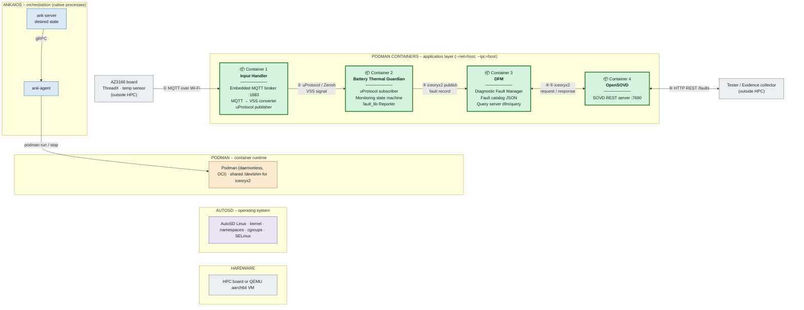

```mermaid
flowchart TB
  subgraph L1["ANKAIOS – orchestration (native processes)"]
    direction LR
    ANKS["ank-server<br/>desired state"] -->|"gRPC"| ANKA["ank-agent"]
  end

  subgraph L2[" "]
    direction LR
    AZ["AZ3166 board<br/>ThreadX · temp sensor<br/>(outside HPC)"]

    subgraph CONT["PODMAN CONTAINERS – application layer (--net=host, --ipc=host)"]
      direction LR
      C1["📦 Container 1<br/><b>Input Handler</b><br/>─────────<br/>Embedded MQTT broker :1883<br/>MQTT → VSS converter<br/>uProtocol publisher"]
      C2["📦 Container 2<br/><b>Battery Thermal Guardian</b><br/>─────────<br/>uProtocol subscriber<br/>Monitoring state machine<br/>fault_lib Reporter"]
      C3["📦 Container 3<br/><b>DFM</b><br/>─────────<br/>Diagnostic Fault Manager<br/>Fault catalog JSON<br/>Query server dfm/query"]
      C4["📦 Container 4<br/><b>OpenSOVD</b><br/>─────────<br/>SOVD REST server :7690"]
      C1 -->|"② uProtocol / Zenoh<br/>VSS signal"| C2
      C2 -->|"③ iceoryx2 publish<br/>fault record"| C3
      C3 <-->|"④⑤ iceoryx2<br/>request / response"| C4
    end

    TESTER["Tester / Evidence collector<br/>(outside HPC)"]

    AZ -->|"① MQTT over Wi-Fi"| C1
    C4 <-->|"⑥ HTTP REST /faults"| TESTER
  end

  subgraph L3["PODMAN – container runtime"]
    PODMAN["Podman (daemonless, OCI) · shared /dev/shm for iceoryx2"]
  end

  subgraph L4["AUTOSD – operating system"]
    OS["AutoSD Linux · kernel · namespaces · cgroups · SELinux"]
  end

  subgraph L5["HARDWARE"]
    HW["HPC board or QEMU aarch64 VM"]
  end

  L1 ~~~ L2 ~~~ L3 ~~~ L4 ~~~ L5
  ANKA -->|"podman run / stop"| PODMAN

  classDef c fill:#d4f4dd,stroke:#2e7d32,stroke-width:3px,color:#16201b;
  classDef a fill:#dbe9f7,stroke:#1f5f99,color:#16201b;
  classDef p fill:#fbe9d0,stroke:#a8611a,color:#16201b;
  classDef o fill:#ece3f5,stroke:#6a3d99,color:#16201b;
  classDef x fill:#eceff1,stroke:#5d6670,color:#16201b;
  class C1,C2,C3,C4 c;
  class ANKS,ANKA a;
  class PODMAN p;
  class OS o;
  class AZ,TESTER,HW x;
  style L2 fill:none,stroke:none
```